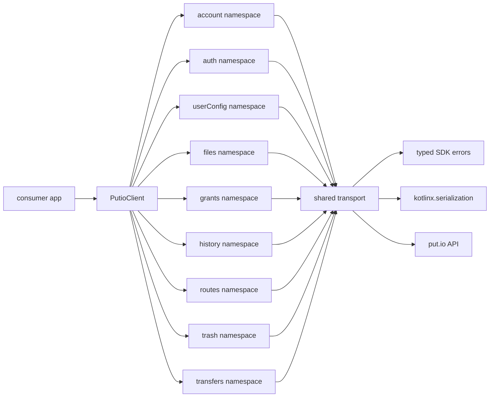

# SDK Overview

## Goal

Explain the actual `putio-sdk-kotlin` package shape for humans and agents.

## System View

## Components

| Component | Responsibility |
| --- | --- |
| `PutioClient` | shared SDK entrypoint and namespace composition |
| Domain namespaces | grouped endpoint operations by product domain |
| Shared transport | OkHttp request execution, auth resolution, and response parsing |
| Error model | configuration, transport, API, operation-aware failures, and user-facing localization |
| Query models | encode request flags and keep call sites explicit |

## Design Rules

- keep the public surface closer to `putio-sdk-typescript` than the legacy Swift SDK
- use coroutine-first suspend APIs for network operations
- parse response JSON at the boundary with `kotlinx.serialization`
- preserve unknown backend string values in public value types instead of failing whole payloads
- keep operator-facing exceptions typed, wrap API failures in `domain.operation` context, and derive user-facing recovery guidance separately through `PutioErrorLocalizer`
- keep namespaces small and explicit until app needs prove expansion
- prefer transport helpers and typed models over generic JSON bags

## Current Namespace Scope

- `account`
  - `getInfo`
  - `getSettings`
  - `saveSettings`
- `auth`
  - `buildLoginUrl`
  - `getCode`
  - `checkCodeMatch`
  - `validateToken`
  - `logout`
  - `generateTotp`
  - `verifyTotp`
  - `getRecoveryCodes`
  - `regenerateRecoveryCodes`
- `userConfig`
  - `get`
  - `save`
  - `setChromecastPlaybackType`
- `files`
  - `list`
  - `continueList`
  - `get`
  - `search`
  - `continueSearch`
  - `createFolder`
  - `copy`
  - `delete`
  - `move`
  - `rename`
  - `findNextFile`
  - `setSortBy`
  - `resetFileSpecificSortSettings`
  - `startMp4Conversion`
  - `getMp4ConversionStatus`
  - `listSubtitles`
  - `getStartFrom`
  - `setStartFrom`
  - `resetStartFrom`
  - direct download and stream URL builders
- `grants`
  - `list`
  - `revoke`
  - `linkDevice`
- `history`
  - `list`
  - `delete`
  - `clear`
- `routes`
  - `list`
- `trash`
  - `list`
  - `continueList`
  - `restore`
  - `delete`
  - `empty`
- `transfers`
  - `list`
  - `continueList`
  - `get`
  - `count`
  - `info`
  - `add`
  - `addMany`
  - `cancel`
  - `clean`
  - `retry`

## Error Context

- `auth`, `files`, `events`, and `trash` now wrap SDK failures with `domain.operation` context before surfacing them to consumers
- `PutioErrorLocalizer` can layer operation-specific recovery guidance on top of the underlying typed API or transport error

## What This Package Is Not

- not a generated OpenAPI dump
- not a callback-oriented wrapper around the old Swift SDK
- not a full namespace-by-namespace parity port on day one
- not tied to Android UI code or app lifecycle types
