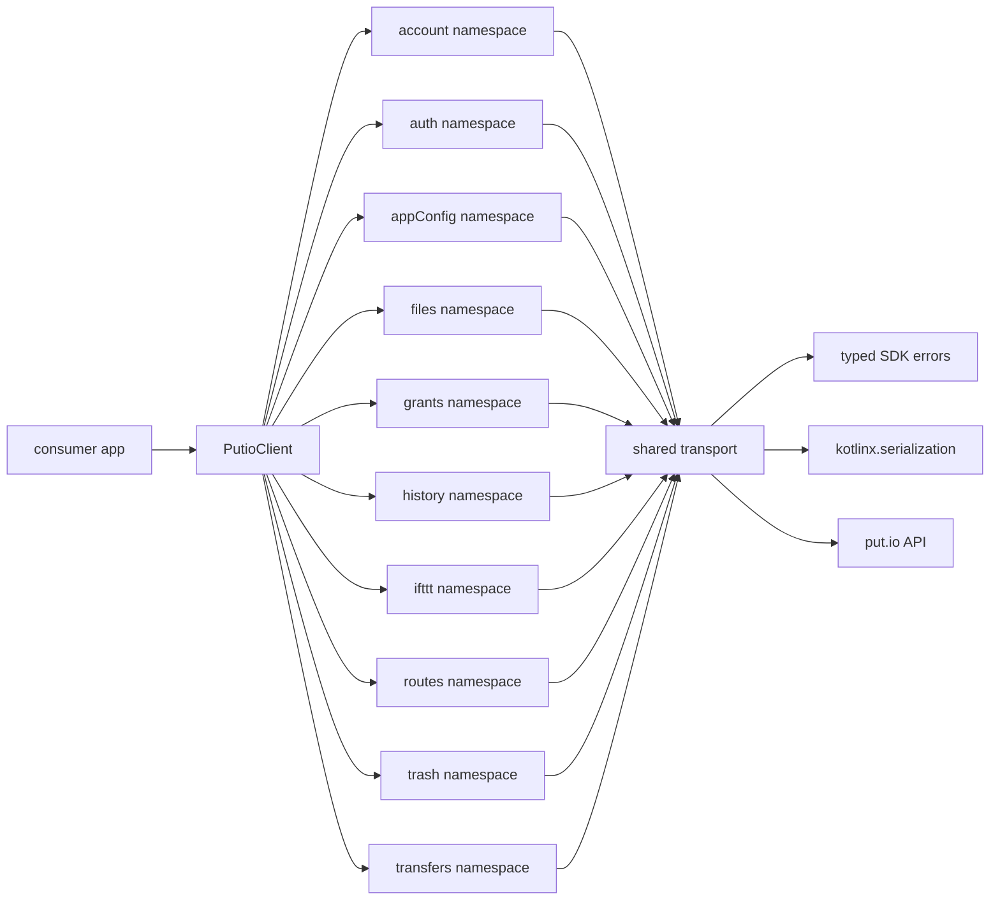

# SDK Overview

## Goal

Explain the actual `putio-sdk-kotlin` package shape for humans and agents.

## System View

## Components

| Component | Responsibility |
| --- | --- |
| `PutioClient` | shared SDK entrypoint and namespace composition |
| Domain namespaces | grouped endpoint operations by product domain |
| Shared transport | OkHttp request execution, auth resolution, and response parsing |
| Error model | configuration, transport, API, operation-aware failures, and user-facing localization |
| Query models | encode request flags and keep call sites explicit |

## Design Rules

- keep the public surface closer to `putio-sdk-typescript` than the legacy Swift SDK
- use coroutine-first suspend APIs for network operations
- parse response JSON at the boundary with `kotlinx.serialization`
- preserve unknown backend string values in public value types instead of failing whole payloads
- keep operator-facing exceptions typed, wrap API failures in `domain.operation` context, and derive user-facing recovery guidance separately through `PutioErrorLocalizer`
- keep namespaces small and explicit until app needs prove expansion
- prefer transport helpers and typed models over generic JSON bags

## Current Namespace Scope

- `account`
  - `getInfo`
  - `getSettings`
  - `saveSettings`
  - `clearData`
  - `destroy`
- `auth`
  - `buildLoginUrl`
  - `getCode`
  - `checkCodeMatch`
  - `validateToken`
  - `logout`
  - `generateTotp`
  - `verifyTotp`
  - `getRecoveryCodes`
  - `regenerateRecoveryCodes`
- `appConfig`
  - `get`
  - `save`
- `files`
  - `list`
  - `continueList`
  - `get`
  - `resolvePlayback`
  - `search`
  - `continueSearch`
  - `createFolder`
  - `copy`
  - `delete`
  - `move`
  - `rename`
  - `findNextFile`
  - `setSortBy`
  - `resetFileSpecificSortSettings`
  - `startMp4Conversion`
  - `getMp4ConversionStatus`
  - `listSubtitles`
  - `getStartFrom`
  - `setStartFrom`
  - `resetStartFrom`
  - direct download, raw stream, and type-aware stream URL builders
- `grants`
  - `list`
  - `revoke`
  - `linkDevice`
- `history`
  - `list`
  - `delete`
  - `clear`
- `ifttt`
  - `sendPlaybackEvent`
- `routes`
  - `list`
- `trash`
  - `list`
  - `continueList`
  - `restore`
  - `delete`
  - `empty`
- `transfers`
  - `list`
  - `continueList`
  - `get`
  - `count`
  - `info`
  - `add`
  - `addMany`
  - `cancel`
  - `clean`
  - `retry`

## Playback Contract

`FilesApi.resolvePlayback` composes strict file details, HLS/MP4/original selection,
conversion state, resume position, and sidecar subtitles into one typed result.
The consumer must supply its app-scoped HLS/MP4 preference and account-wide resume
setting. It may also declare `originalVideoPlayable` after platform proof; the SDK
does not read or own `/config` playback keys.

Direct media URLs use the account `download_token`, decoded as an
`AccountDownloadToken` and supplied as a `PlaybackMediaCredential`. The account token,
playback credential, and resolved URL redact their debug representations. Consumers may reveal the URL only at the player boundary and must
not log, persist, cache, share, or attach it to analytics, notifications, or errors.

The account-wide resume setting is `use_start_from` (`AccountSettings.useStartFrom`);
the app passes it as `PlaybackRequest.useStartFrom`, while the per-file offset remains
`start_from` (`PlaybackSource.startFromSeconds`). Optional sidecar subtitle failures do
not block an otherwise ready source: consumers receive `PlaybackSubtitles.Unavailable`
with a typed API, transport, or invalid-response reason and may show a non-blocking
warning. Authentication failures still surface normally.
Next-file
lookup stays on `FilesApi.findNextFile` so an autoplay lookup failure cannot block the
current playback source.

When a video still needs conversion, resolution reads the canonical
`GET /files/{id}/mp4` status endpoint. The backend may use that read to recover an
existing stalled conversion; the resolver never starts conversion with `POST`.

Consumers handle `PlaybackConversionState` as follows:

- `Queued` and `Converting` render the interstitial and poll `resolvePlayback` with
  bounded delay and lifecycle cancellation.
- `Completed` triggers one immediate resolution refresh so strict file details can
  produce `Ready`; if it remains completed, stop and offer retry or Back.
- `Failed` stops polling and offers an explicit retry action. Only that user action
  may call `startMp4Conversion`.
- `NotAvailable` is terminal for the parity source; offer Back or download instead.
- `Unknown` preserves the backend value, stops automatic polling, and offers retry
  or Back.

## Error Context

- domain namespaces wrap SDK failures with `domain.operation` context before surfacing them to consumers
- `PutioErrorLocalizer` can layer operation-specific recovery guidance on top of the underlying typed API or transport error
- transport exceptions expose a stable failure kind and retain sanitized timeout, DNS, connection, TLS, protocol, and I/O cause types
- SDK-created exceptions redact credential-bearing query values from request URLs while retaining the method, path, query names, and non-sensitive query values

## What This Package Is Not

- not a generated OpenAPI dump
- not a callback-oriented wrapper around the old Swift SDK
- not a full namespace-by-namespace parity port on day one
- not tied to Android UI code or app lifecycle types
