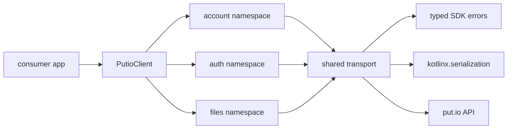

# SDK Overview

## Goal

Explain the actual `putio-sdk-kotlin` package shape for humans and agents.

## System View

## Components

| Component | Responsibility |
| --- | --- |
| `PutioClient` | shared SDK entrypoint and namespace composition |
| Domain namespaces | grouped endpoint operations by product domain |
| Shared transport | OkHttp request execution, auth resolution, and response parsing |
| Error model | configuration, transport, API, and serialization failures |
| Query models | encode request flags and keep call sites explicit |

## Design Rules

- keep the public surface closer to `putio-sdk-typescript` than the legacy Swift SDK
- use coroutine-first suspend APIs for network operations
- parse response JSON at the boundary with `kotlinx.serialization`
- keep namespaces small and explicit until app needs prove expansion
- prefer transport helpers and typed models over generic JSON bags

## Current Namespace Scope

- `account`
  - `getInfo`
  - `getSettings`
- `auth`
  - `buildLoginUrl`
  - `getCode`
  - `checkCodeMatch`
  - `validateToken`
- `files`
  - `list`
  - `get`
  - `createFolder`
  - `delete`
  - `move`
  - direct download and stream URL builders

## What This Package Is Not

- not a generated OpenAPI dump
- not a callback-oriented wrapper around the old Swift SDK
- not a full namespace-by-namespace parity port on day one
- not tied to Android UI code or app lifecycle types

