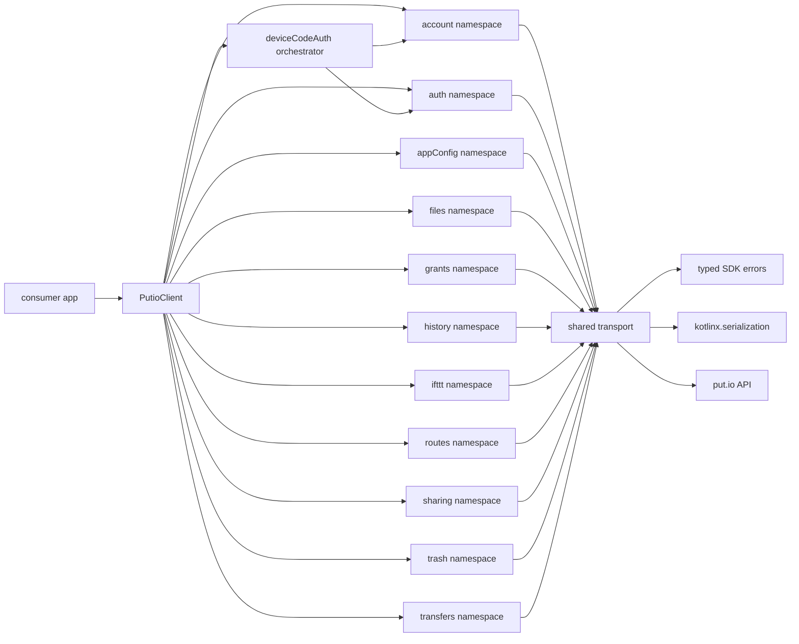

# SDK Overview

## System View

```mermaid
graph LR
  Consumer["consumer app"] --> Client["PutioClient"]
  Client --> Account["account namespace"]
  Client --> Auth["auth namespace"]
  Client --> DeviceCode["deviceCodeAuth orchestrator"]
  Client --> Config["appConfig namespace"]
  Client --> Files["files namespace"]
  Client --> Grants["grants namespace"]
  Client --> History["history namespace"]
  Client --> Ifttt["ifttt namespace"]
  Client --> Routes["routes namespace"]
  Client --> Sharing["sharing namespace"]
  Client --> Trash["trash namespace"]
  Client --> Transfers["transfers namespace"]
  Account --> Transport["shared transport"]
  Auth --> Transport
  DeviceCode --> Auth
  DeviceCode --> Account
  Config --> Transport
  Files --> Transport
  Grants --> Transport
  History --> Transport
  Ifttt --> Transport
  Routes --> Transport
  Sharing --> Transport
  Trash --> Transport
  Transfers --> Transport
  Transport --> Errors["typed SDK errors"]
  Transport --> Json["kotlinx.serialization"]
  Transport --> API["put.io API"]
```

## Components

| Component | Responsibility |
| --- | --- |
| `PutioClient` | shared SDK entrypoint and namespace composition |
| Domain namespaces | grouped endpoint operations by product domain |
| Shared transport | OkHttp request execution, auth resolution, and response parsing |
| Error model | configuration, transport, API, operation-aware failures, and user-facing localization |
| Query models | encode request flags and keep call sites explicit |

## Design Rules

- keep the public surface close to `putio-sdk-typescript`
- use coroutine-first suspend APIs for network operations
- parse response JSON at the boundary with `kotlinx.serialization`
- preserve unknown backend string values in public value types instead of failing whole payloads
- keep operator-facing exceptions typed, wrap API failures in `domain.operation` context, and derive user-facing recovery guidance separately through `PutioErrorLocalizer`
- keep namespaces small and explicit until app needs prove expansion
- prefer transport helpers and typed models over generic JSON bags
- no Android UI or app lifecycle types in the SDK

## Current Namespace Scope

- `account`
  - `getInfo`
  - `getSettings`
  - `saveSettings` (includes the cross-client privacy controls `diagnostics_enabled`, `product_analytics_enabled`, and `support_widget_enabled`; absent keys read as `true`)
  - `clearData`
  - `destroy`
- `auth`
  - `buildLoginUrl`
  - `getCode`
  - `checkCodeMatch`
  - `validateToken`
  - `logout`
  - `generateTotp`
  - `verifyTotp`
  - `getRecoveryCodes`
  - `regenerateRecoveryCodes`
- `deviceCodeAuth`
  - `link` (see Device-Code Contract)
- `appConfig`
  - `get`
  - `save`
- `files`
  - `list`
  - `continueList`
  - `get`
  - `resolvePlayback`
  - `search`
  - `continueSearch`
  - `createFolder`
  - `upload` (multipart to `PutioConfig.uploadBaseUrl`, default `https://upload.put.io/v2/`; returns the saved file or, for a `.torrent`/`.magnet` name, the started transfer; `requireTorrent` sends `torrent=true` so put.io rejects non-torrent content with `NotTorrent` instead of storing it)
  - `copy`
  - `delete`
  - `move`
  - `rename`
  - `findNextFile`
  - `setSortBy`
  - `resetFileSpecificSortSettings`
  - `startMp4Conversion`
  - `getMp4ConversionStatus`
  - `listSubtitles`
  - `getStartFrom`
  - `setStartFrom`
  - `resetStartFrom`
  - `getDownloadUrl` (API-issued URL with its own token, bound to the requesting IP; for external players that must not receive the account token)
  - `buildDownloadUrl`, `buildMp4DownloadUrl`, `buildStreamUrl`, `buildHlsStreamUrl`, `buildOriginalStreamUrl`, `buildAudioStreamUrl`
- `grants`
  - `list`
  - `revoke`
  - `linkDevice`
- `history`
  - `list`
  - `delete`
  - `clear`
  - `HistoryEventType` constants carry the API's lowercase wire values (`transfer_completed`, `file_shared`, ...); `fromRaw` matches any casing to the canonical constant and keeps unknown types verbatim; `FILE_FROM_RSS_DELETED_ERROR` is a deprecated alias of `FILE_FROM_RSS_DELETED_FOR_SPACE`
- `ifttt`
  - `sendPlaybackEvent`
- `routes`
  - `list`
- `sharing`
  - `shareFiles` (to everyone or named friends)
  - `listSharedFiles`
  - `getSharedWith`
  - `unshare` (named share ids), `unshareAll`
  - `publicShares.create`, `publicShares.list`, `publicShares.delete`; `PublicShare.token` and `pushToken` are bearer secrets with redacted `toString`
- `trash`
  - `list`
  - `continueList`
  - `restore`
  - `delete`
  - `empty`
- `transfers`
  - `list`
  - `continueList`
  - `get`
  - `count`
  - `info`
  - `add`
  - `addMany`
  - `cancel`
  - `clean`
  - `retry`

## Device-Code Contract

`DeviceCodeAuth.link` is a cold `Flow<DeviceCodeAuthState>` that runs one linking
attempt from the auth-and-device-linking contract: `Requesting` → `AwaitingLink(code,
qrCodeUrl, budget)` → `Validating` → `Linked(accessToken, account)`. The consumer shows the
code and `put.io/link`, and stores the token from `Linked`; it never polls. Polling uses
`DeviceCodeAuthOptions` (three-second interval, five-minute budget by default, matching the
shipping TV app). A 404 from the match endpoint or a rejected validation ends the attempt in
`Expired(CODE_REJECTED)`; running out the budget ends it in `Expired(BUDGET_ELAPSED)`; either
way "Get new code" is a fresh collection. Transport failures while polling are retried inside
the budget; any other SDK error ends the attempt in `Failed(error)` for `PutioErrorLocalizer`.
Cancelling the collector stops polling. `Linked.toString()` omits the token.

## Playback Contract

`FilesApi.resolvePlayback` composes strict file details, HLS/MP4/original selection,
conversion state, resume position, and sidecar subtitles into one typed result.
The consumer must supply its app-scoped HLS/MP4 preference and account-wide resume
setting. It may also declare `originalVideoPlayable` after platform proof; the SDK
does not read or own `/config` playback keys.

Direct media URLs use the account `download_token`, decoded as an
`AccountDownloadToken` and supplied as a `PlaybackMediaCredential`. The account token,
playback credential, and resolved URL redact their debug representations. Consumers may reveal the URL only at the player boundary and must
not log, persist, cache, share, or attach it to analytics, notifications, or errors.

The account-wide resume setting is `use_start_from` (`AccountSettings.useStartFrom`);
the app passes it as `PlaybackRequest.useStartFrom`, while the per-file offset remains
`start_from` (`PlaybackSource.startFromSeconds`). Optional sidecar subtitle failures do
not block an otherwise ready source: consumers receive `PlaybackSubtitles.Unavailable`
with a typed API, transport, or invalid-response reason and may show a non-blocking
warning. Authentication failures still surface normally. Next-file lookup stays on
`FilesApi.findNextFile` so an autoplay lookup failure cannot block the current playback
source.

HLS masters follow the account's `hide_subtitles` setting: when it is on, the API leaves
every subtitle rendition out unless the URL sets `max_subtitle_count`.
`PlaybackRequest.maxSubtitleCount` and `buildHlsStreamUrl(maxSubtitleCount = ...)` send it;
`HLS_ALL_SUBTITLES` (`-1`) asks for every rendition, so a player that starts subtitles off
can still offer them.

When a video still needs conversion, resolution reads the canonical
`GET /files/{id}/mp4` status endpoint. The backend may use that read to recover an
existing stalled conversion; the resolver never starts conversion with `POST`.

Consumers handle `PlaybackConversionState` as follows:

- `Queued` and `Converting` render the interstitial and poll `resolvePlayback` with
  bounded delay and lifecycle cancellation.
- `Completed` triggers one immediate resolution refresh so strict file details can
  produce `Ready`; if it remains completed, stop and offer retry or Back.
- `Failed` stops polling and offers an explicit retry action that calls
  `startMp4Conversion`.
- `NotAvailable` is not terminal: the file needs conversion but none has been
  requested. When the viewer opened the file to play it, call `startMp4Conversion`
  once, as put.io's web, iOS and TV clients do; it moves the file to `Queued` or
  `Converting`. Back and download stay available.
- `Unknown` preserves the backend value, stops automatic polling, and offers retry
  or Back.

The resolver never calls `startMp4Conversion`. Consumers call it once per viewer open
of a `NotAvailable` file and on an explicit retry after `Failed`; never from polling.

## Error Context

- `files.get` and `files.createFolder` require `status: "OK"` before returning the response file; non-OK HTTP 2xx envelopes are typed serialization failures
- `files.delete` requires `status: "OK"`, a nonnegative `skipped`, and a non-blank `cursor` when present; `files.move` requires `status: "OK"` and an `errors` list
- `OkResponse` requires `status: "OK"`; a non-OK acknowledgement on HTTP 2xx is a serialization failure with operation context
- Trash list decoding requires explicit files and nonnegative initial totals; continuation may omit totals, so consumers retain the initial aggregates instead of replacing them with continuation defaults
- domain namespaces wrap SDK failures with `domain.operation` context before surfacing them to consumers
- `PutioErrorLocalizer` can layer operation-specific recovery guidance on top of the underlying typed API or transport error
- transport exceptions expose a stable failure kind and retain sanitized timeout, DNS, connection, TLS, protocol, and I/O cause types
- SDK-created exceptions redact credential-bearing query values from request URLs while retaining the method, path, query names, and non-sensitive query values
